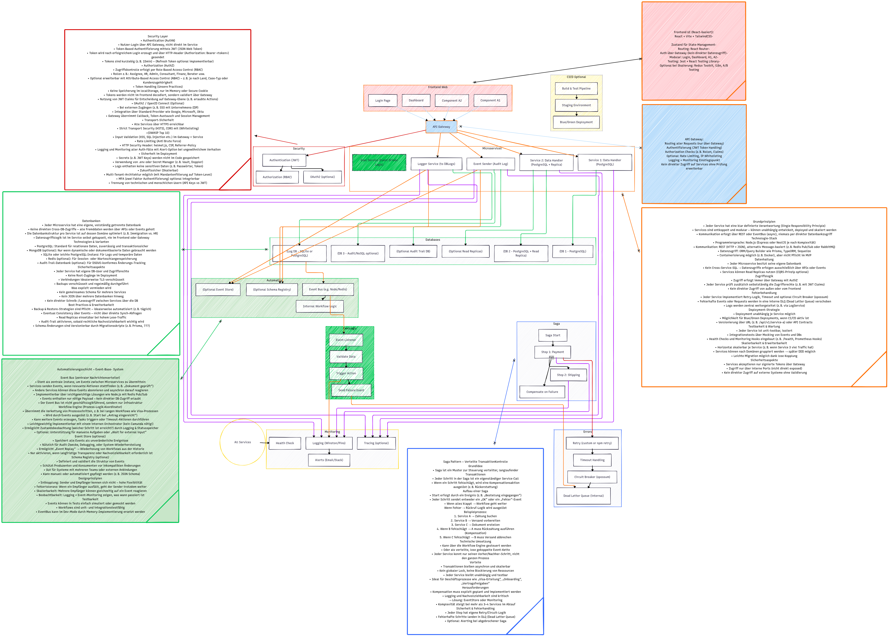

# AiCUnet – KI-gestützte ( Bereite ) Architekturplattform

FÜR GENAUERE INFORMATIONEN UNBEDINGT DIE INHALTE VON docs/ FOLDER ZU LESEN! 
README IST NICHT UPDATE

> Eine modulare, skalierbare und automatisierte Architektur für HR-Tech & Global Mobility Services als Herz des Unternehmens ICUnet Ag.

---

##  Übersicht

Diese Repository enthält eine vollständige, dokumentierte Referenz-Architektur für ein moderne, Microservice-basierte Software. 

kommt noch weitere Informationen in der nahe Zukunft.

---

##  Architekturdiagramm

Architektur ist modular aufgebaut, Event-basiert und vollständig dokumentiert:



Automatisch generieren via [`generate-diagrams.sh`](./mermaid/generate-diagrams.sh)

---

## Struktur

```bash
├── .github/workflows/             
│   └── ci.yml
├── docs/                         
│   ├── automation.md             
│   ├── CICD.md                   
│   ├── datenbanken.md            
│   ├── error-handling.md         
│   ├── frontend.md               
│   ├── gateway.md                
│   ├── index.md                  
│   ├── microservices.md          
│   ├── monitoring.md             
│   ├── saga.md                   
│   └── security.md               
├── mermaid/                      
│   ├── aicunet-architektur.mmd   
│   ├── generate-diagrams.sh      
│   └── aicunet-architektur.png   
└── README.md
```

---

## Technologien

- **Frontend**: React + TailwindCSS + React Router
- **Backend**: Node.js + Express / NestJS
- **Event Bus**: intern / optional RabbitMQ / Kafka
- **Workflow Engine**: intern und simple
- **Security**: JWT + Role/Claim Check + optional OAuth2
- **Logging**: Winston / ELK / Prometheus
- **Datenbanken**: PostgreSQL, Audit-Trail, Replikate

---

## Architektur basiert auf:

- Separation of Concerns
- Domain Driven Design (leichtgewichtig)
- Kein harter Monolith
- Events instead of direkter Coupling
- Wiederverwendbarkeit, Testbarkeit, Erweiterbarkeit

---

## Lizenz & Nutzung

Kommt noch! 
---

 > Für Fragen direkt Email an rezaghaemijob@gmail.com.

